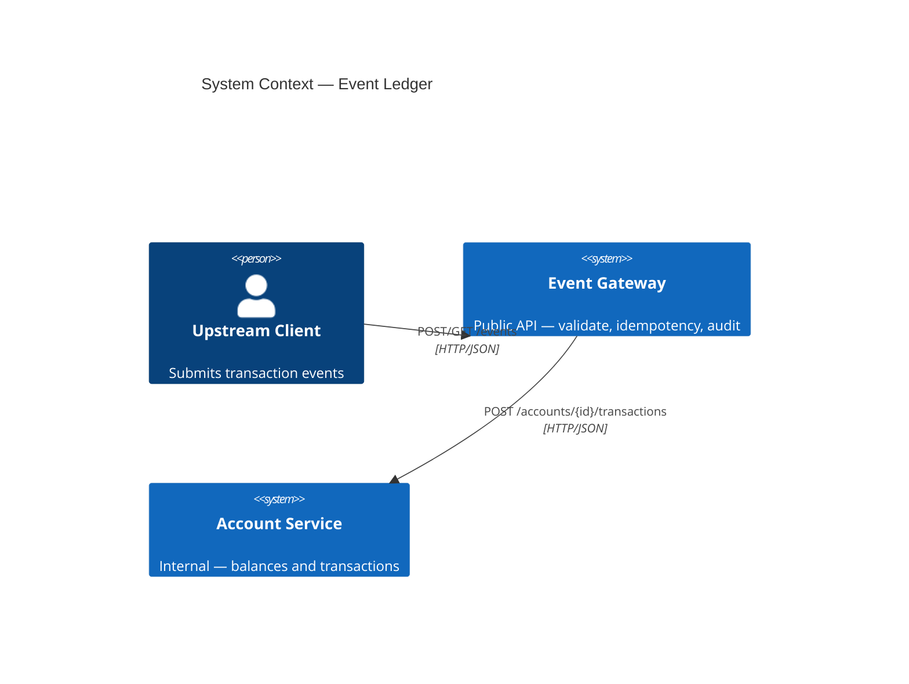
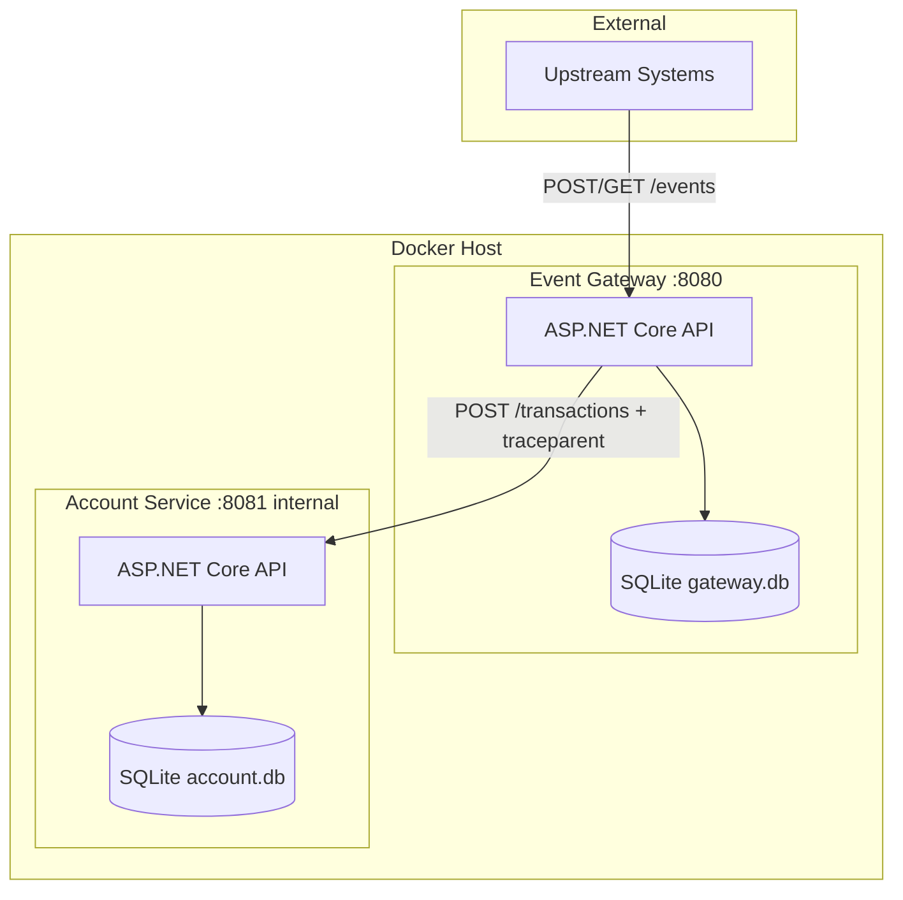
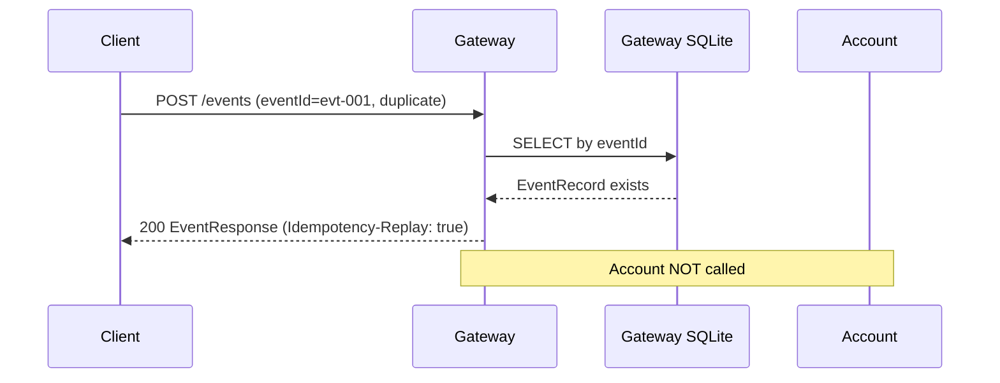
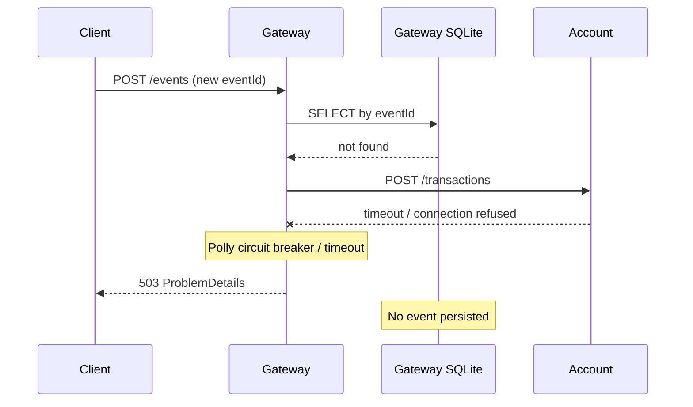
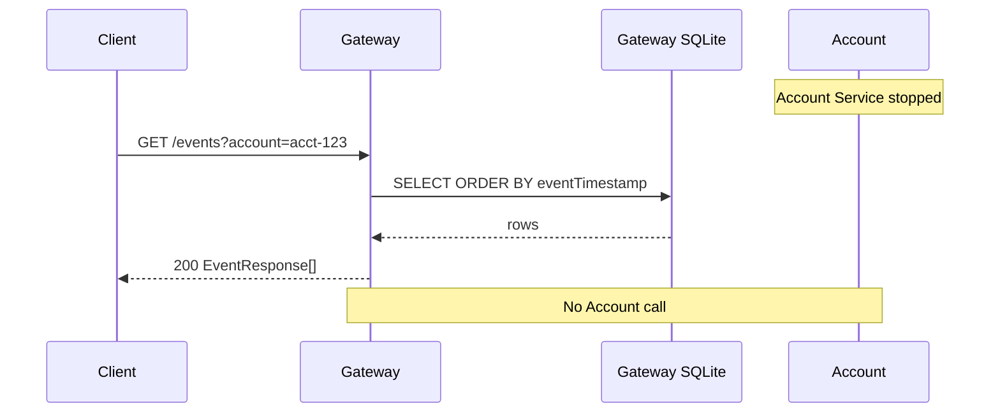
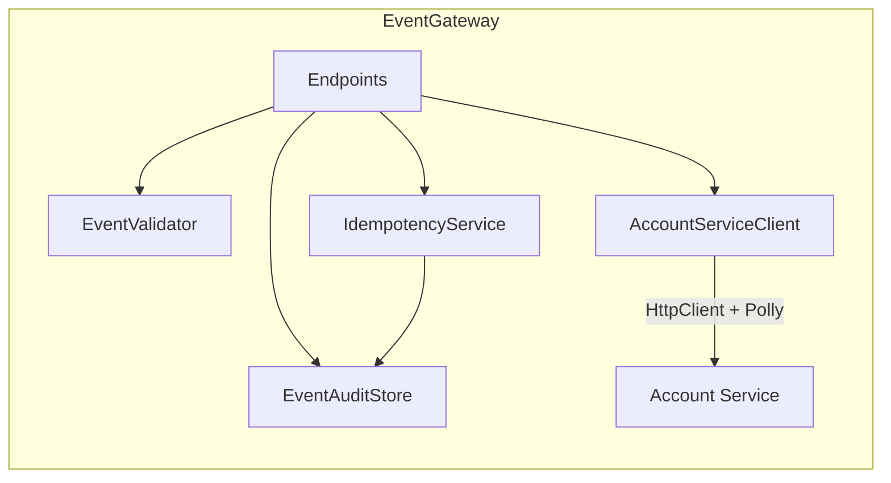
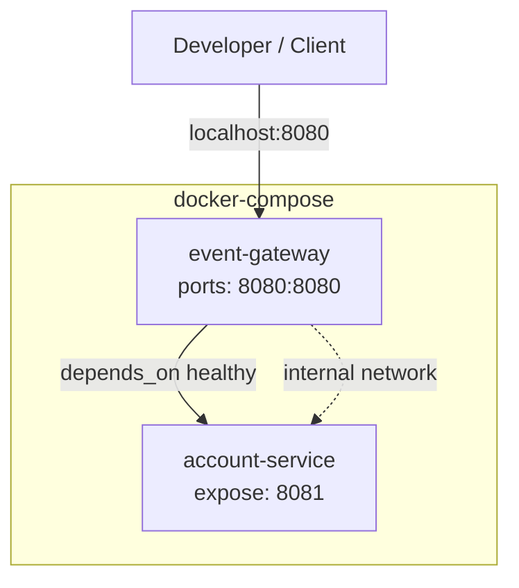

# Event Ledger — Architecture Diagrams

**Task:** T-04 · **Agent:** ARCH-01  
**Format:** Mermaid

---

## 1. System context



---

## 2. Container diagram



---

## 3. Sequence — happy path POST /events

```mermaid
sequenceDiagram
  autonumber
  participant Client
  participant Gateway
  participant GatewayDB as Gateway SQLite
  participant Account
  participant AccountDB as Account SQLite

  Client->>Gateway: POST /events (eventId=evt-001)
  Gateway->>Gateway: Validate payload
  Gateway->>GatewayDB: SELECT by eventId
  GatewayDB-->>Gateway: not found

  Gateway->>Account: POST /accounts/acct-123/transactions
  Note over Gateway,Account: traceparent header propagated

  Account->>AccountDB: BEGIN; upsert Account; INSERT Transaction
  AccountDB-->>Account: OK
  Account-->>Gateway: 201 TransactionResponse

  Gateway->>GatewayDB: INSERT EventRecord
  Gateway-->>Client: 201 EventResponse
```

---

## 4. Sequence — idempotent duplicate



---

## 5. Sequence — Account Service unavailable



---

## 6. Sequence — GET events while Account down



---

## 7. Component diagram — Event Gateway



---

## 8. Deployment — Docker Compose


